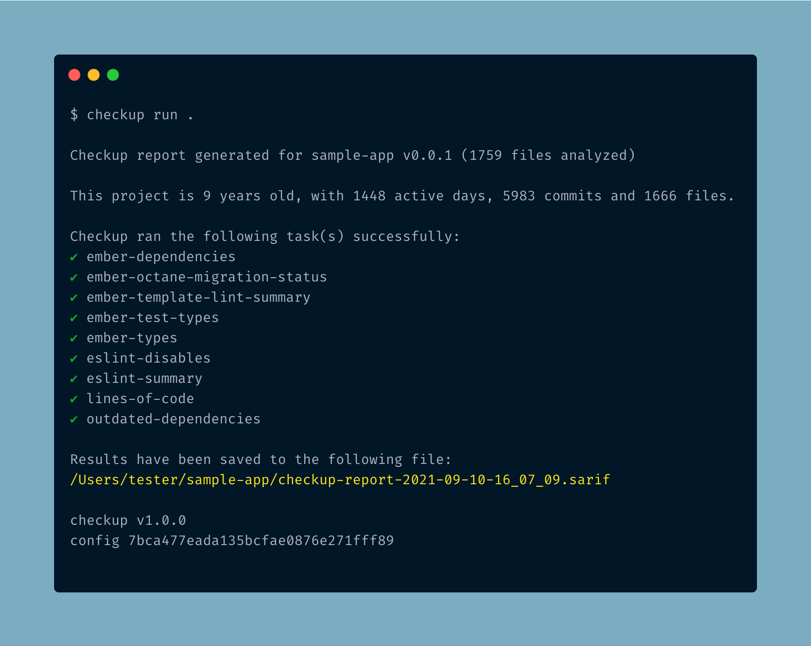

<p align="center">
<!-- ALL-CONTRIBUTORS-BADGE:START - Do not remove or modify this section -->
[](#contributors-)
<!-- ALL-CONTRIBUTORS-BADGE:END -->
  
</p>

<p style="font-style: italic; font-size: 20px; margin-bottom: 20px">Use static analysis and gain insights to help drive maintenance decisions</p>


[](https://github.com/checkupjs/checkup/blob/master/package.json)


[](#badge)

Checkup is a framework that uses static analysis and gain insights to help drive maintenance decisions. It provides a framework to run **tasks** to gather information about the craftsmanship and quality of your codebase. Task results are output as [SARIF](https://sarifweb.azurewebsites.net/), which provides a consistent schema for data processing, and can be integrated into your development workflow through IDE integrations.



Checkup allows you to determine the important information you care about, and provides the infrastructure to gather and output that data.

Tasks can gather insights on things like

- **Code structure** - to give shape to your project, which can help you understand the codebase and identify areas of improvement
- **Dependency health** - such as which dependency versions are out of date, or outside supported ranges
- **Test health** - to identify types of tests used, which tests are being skipped, and what the [shape](https://martinfowler.com/articles/2021-test-shapes.html) of the test infrastructure is
- **API compatability** - to identify which APIs are being used, and which are not
- **Migration status** - to give practical insight into how your codebase is being migrated
- Anything else you can dream up... :bulb:

## Features

- **Task Runner CLI** - A [CLI](packages/cli/README.md) that runs tasks that can be loaded via plugins.
- **Code Generators** - A collection of generators allowing you to generate a checkup **config** file, **plugin** project structure, and **task** files and tests.
- **Plugins** - Existing plugins for **JavaScript**, **Ember**, and **Ember Octane**.

## Installation

To install Checkup, run the following command:

```bash
$ npm install @checkup/cli
```

## Usage

See the [CLI README](packages/cli/README.md) for information on usage.

## Contributing

To contribute, please read the [CONTRIBUTING](CONTRIBUTING.md) guidelines.

## Contributors ✨

Thanks goes to these wonderful people ([emoji key](https://allcontributors.org/docs/en/emoji-key)):

<!-- ALL-CONTRIBUTORS-LIST:START - Do not remove or modify this section -->
<!-- prettier-ignore-start -->
<!-- markdownlint-disable -->
<table>
  <tr>
    <td align="center"><a href="https://github.com/scalvert"><br /><sub><b>Steve Calvert</b></sub></a><br /><a href="https://github.com/scalvert/checkup/commits?author=scalvert" title="Code">💻</a> <a href="#question-scalvert" title="Answering Questions">💬</a> <a href="https://github.com/scalvert/checkup/pulls?q=is%3Apr+reviewed-by%3Ascalvert" title="Reviewed Pull Requests">👀</a> <a href="#infra-scalvert" title="Infrastructure (Hosting, Build-Tools, etc)">🚇</a></td>
    <td align="center"><a href="https://github.com/carakessler"><br /><sub><b>carakessler</b></sub></a><br /><a href="https://github.com/scalvert/checkup/commits?author=carakessler" title="Code">💻</a> <a href="#question-carakessler" title="Answering Questions">💬</a> <a href="https://github.com/scalvert/checkup/pulls?q=is%3Apr+reviewed-by%3Acarakessler" title="Reviewed Pull Requests">👀</a> <a href="#infra-carakessler" title="Infrastructure (Hosting, Build-Tools, etc)">🚇</a></td>
    <td align="center"><a href="https://github.com/zhanwang626"><br /><sub><b>Zhan Wang</b></sub></a><br /><a href="https://github.com/scalvert/checkup/commits?author=zhanwang626" title="Code">💻</a> <a href="https://github.com/scalvert/checkup/pulls?q=is%3Apr+reviewed-by%3Azhanwang626" title="Reviewed Pull Requests">👀</a></td>
    <td align="center"><a href="https://github.com/mahirshah"><br /><sub><b>Mahir Shah</b></sub></a><br /><a href="https://github.com/scalvert/checkup/commits?author=mahirshah" title="Code">💻</a></td>
    <td align="center"><a href="https://github.com/tylerbecks"><br /><sub><b>Tyler Becks</b></sub></a><br /><a href="https://github.com/scalvert/checkup/commits?author=tylerbecks" title="Code">💻</a></td>
    <td align="center"><a href="https://www.gabrielcsapo.com/"><br /><sub><b>Gabriel Csapo</b></sub></a><br /><a href="https://github.com/scalvert/checkup/commits?author=gabrielcsapo" title="Code">💻</a></td>
    <td align="center"><a href="http://lisaqyli.com/"><br /><sub><b>Lisa Li</b></sub></a><br /><a href="https://github.com/scalvert/checkup/commits?author=lisaqyli" title="Code">💻</a></td>
  </tr>
  <tr>
    <td align="center"><a href="http://evansolomon.me/"><br /><sub><b>Evan Solomon</b></sub></a><br /><a href="https://github.com/scalvert/checkup/commits?author=evansolomon" title="Code">💻</a></td>
    <td align="center"><a href="https://www.omayeli.com/"><br /><sub><b>Omayeli Arenyeka</b></sub></a><br /><a href="https://github.com/scalvert/checkup/commits?author=oa495" title="Code">💻</a></td>
    <td align="center"><a href="http://twitter.com/chadhietala"><br /><sub><b>Chad Hietala</b></sub></a><br /><a href="https://github.com/scalvert/checkup/commits?author=chadhietala" title="Code">💻</a></td>
    <td align="center"><a href="https://www.rwjblue.com/"><br /><sub><b>Robert Jackson</b></sub></a><br /><a href="https://github.com/scalvert/checkup/commits?author=rwjblue" title="Code">💻</a> <a href="#question-rwjblue" title="Answering Questions">💬</a> <a href="https://github.com/scalvert/checkup/pulls?q=is%3Apr+reviewed-by%3Arwjblue" title="Reviewed Pull Requests">👀</a> <a href="#infra-rwjblue" title="Infrastructure (Hosting, Build-Tools, etc)">🚇</a></td>
    <td align="center"><a href="https://github.com/brendenpalmer"><br /><sub><b>Brenden Palmer</b></sub></a><br /><a href="https://github.com/scalvert/checkup/commits?author=brendenpalmer" title="Code">💻</a></td>
  </tr>
</table>

<!-- markdownlint-restore -->
<!-- prettier-ignore-end -->

<!-- ALL-CONTRIBUTORS-LIST:END -->

This project follows the [all-contributors](https://github.com/all-contributors/all-contributors) specification. Contributions of any kind welcome!
